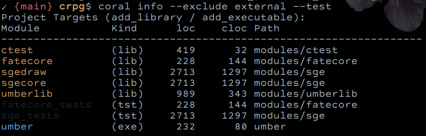
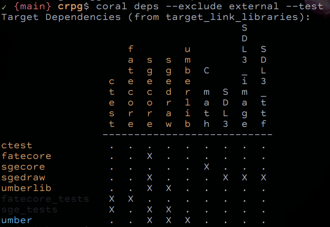

# Coral: Modular C Projects

This project is a set of scripts and templates to support a Polylith style
structure for CMake based C projects. Coral is structured, yet forms
organically.

**This is still an early work in progress.**

Polylith is a project structure and architectural style that has gained some
popularity in Clojure and Python. It encourages modular design within a
monorepo style project structure. As components become generalised, they can
be refactored into separate building blocks available for use to multiple
other components.

Polylith building blocks take the form of:

- Components: A functional building block exposing an API, usually
              encapsulating a set of related functional units.
- Bases: A thin layer of code which composes one or more units into a service,
         library or process, delegating most funtionality to components.
- Projects: A project combines one base (in the usual case) with multiple
            components to build a final deployable artifact.

## Usage

Currently 3 commands are supported:

### coral info

Will show some details of each module found: name, kind (lib, exe, tst), path
and rough counts for lines of count and comment lines.



### coral deps

Will show a matrix report of modules and which other modules they require via
linkage.



### coral libs

Will list any external libraries added via find_package.


## Coral Rationale

Descriptive, not prescriptive.

Coral aims to describe your CMake project structure without imposing
architectural decisions. In its current implementation, coral simply looks
for a few specific CMake declarations:

- **find_package** to build the list of external libraries
- **add_library** and **add_executable** to build the list of project targets, and
- **target_link_libraries** to build the dependency matrix.

Restrictions around naming conventions or directory layout are avoided. As
long as a CMakeLists.txt file exists for each module unit, it will be
parsed. The only exception currently is that any module or binary target that
includes the substring 'test' will be assumed to be a testing asset and will
be elided from output unless the '--tests' flag is supplied.

I'm interested in the following aspects of the Polylith tooling:

- Being able to view a dependency matrix of modules
- Showing reports of library usage across modules
- Showing code statistics broken down by module
- Having a flatter structure of components, in contrast to transitive
  dependencies.

## Prototype

The building blocks of a Coral Project will be the following then. Analogous
to Polylith blocks:

- Module: A CMake INTERFACE or LIBRARY 'add_library' target providing headers
          and/or static or shared libraries. The declaration of these should
          ensure that linking this CMake module provides all public interfaces
          to the destination target.

- Base: A CMake EXECUTABLE 'add_executable' target that links in one or
        more Modules with a thin layer of code to handle entrypoint
        initialisation.

- Project: A CMake Project that acts as the super-project for one or more
           bases and one or more modules. It is also responsible for
           satisfying any external dependencies required by the building
           blocks (via find_package, etc).

A Coral Project might have an example structure as follows:

```
<MyGame>
  +- CMakeLists.txt        (super-project)
  +- README.md
  +- LICENSE
  +- modules
  |  +- gamelib
  |  |  +- CMakeLists.txt  (add_library(gamelib))
  |  |  +- include/gamelib (headers namespaced)
  |  |  +- src/
  |  +- draw3d
  |  |  +- include/draw3d
  |  |  +- src/
  |  +- MyGameImpl
  |  |  +- include/MyGame
  |  |  +- src
  +- MyGame
     +- CMakeLists.txt     (add_executable(MyGame))
     +- src
```

## Other thoughts

### Why not libraries

When I tried Polylith within a Clojure project, I did see the value of having
all code availabe in the same repo. It makes it easy to modify a library
function without the cycle of test, build, install. Of course, that also comes
with added responsibility: Being careful not to break interfaces carelessly.

If you're working in a Clojure project which heavily relies on external
libraries, you lose an aspect of the Lisp programming experience which is
interactive programing and dynamic code reloading. Polylith restores a little
of this by allowing a hybrid workflow of modularised building blocks (a la
libraries) but having the code in the same repo allows changes to library code
to be quickly reloaded and tested in the running image.

That's less of an issue in C, where build, test, run, install is a more common
development workflow. However, I think there still might be some benefit to
the immediacy of having functions defined right there in a project, but still
organised into modular directories (even brought in via git submodules), and
being able to redefine and test module behaviour.

### Testing

There are no impositions made on where to put tests, per the goal of
flexibility. What works for me is putting a test directory, 't/', in each
module and using 'ctest' (a simple header only unit test interface) to create
the harness via a 'tests.c' file. I've implemented a single convention in the
Coral script: If an executable target in CMake ends with '_tests' then it will
be hidden from output unless the flag '--tests' is included.

This allows me to colocate unit tests with the corresponding module, build a
test executable to run the tests, but not have typical coral output filled
with such test executables by default.

Of course, one could simply have a Base which runs tests for one or more
modules, or more advanced integration tests.

### Trade Offs

In the current implementation, I make no attempt to have 'Modules' compilable
outside the context of a Coral Project. In fact, I put a CMake fatal_error
block in a module's CMakeList.txt file to explicitly disallow it. This is
because I don't want to end up reimplemting recursive module dependencies. A
Coral Project should be a simple flat structure of one or more Modules and one
or more Bases. It's up to the project to satisfy the dependencies for all
modules and bases.

A Coral Project should therefore ensure a named definition of
'CORAL_PROJECT_NAME' exists at the top-level of the project. Modules
will/can/should guard against standalone builds with

```
if (NOT DEFINED CORAL_PROJECT_NAME)
  message(
    FATAL_ERROR
    "${PROJECT_NAME} is a coral module and must be built as part of a project.
  )
endif()
```
